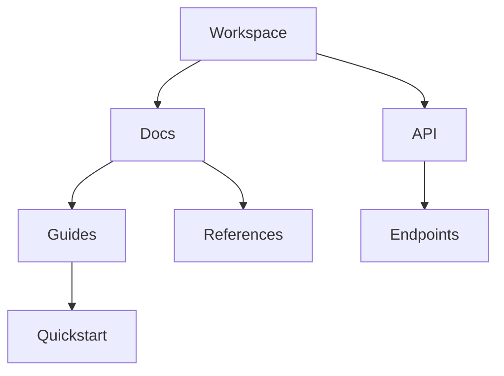

## Overview

Deepika Nallana provides powerful tools to create, organize, search, and share your documentation efficiently. You manage projects with intuitive interfaces that support collaboration and scalability. Key capabilities include real-time editing, hierarchical folder systems, advanced search, and flexible export options.

<Columns cols={2}>
  <Card title="Create & Edit" icon="edit-3" href="#document-creation">
    Build rich documents with Markdown, embeds, and version history.
  </Card>
  <Card title="Organize" icon="folder" href="#organization">
    Structure content using folders, tags, and permissions.
  </Card>
  <Card title="Search & Filter" icon="search" href="#search">
    Quickly find documents with full-text search and filters.
  </Card>
  <Card title="Export & Share" icon="share-2" href="#export">
    Generate PDFs, share links, or integrate via API.
  </Card>
</Columns>

## Document Creation and Editing

You create new documents instantly from the dashboard or via keyboard shortcuts. The editor supports Markdown, code blocks, and interactive components like diagrams.

<Steps>
  <Step title="Start a New Document" icon="plus">
    Click the <kbd>New</kbd> button or press <kbd>Cmd</kbd>+<kbd>N</kbd>.
  </Step>
  <Step title="Edit Content">
    Use the WYSIWYG editor or switch to Markdown view.

````markdown
# Welcome Document

## Introduction

This is your first doc in Deepika Nallana.

- List item 1
- List item 2
````

  </Step>
  <Step title="Preview and Save" icon="save">
    Toggle preview mode and auto-save is enabled by default.
  </Step>
</Steps>

<Callout kind="tip">
  Enable version history in settings to track changes over time.
</Callout>

## Organization and Folder Structures

You organize documents into nested folders for better navigation. Assign permissions at folder level to control access.



| Feature          | Description                          | Use Case                  |
|------------------|--------------------------------------|---------------------------|
| Folders          | Unlimited nesting                    | Project hierarchies       |
| Tags             | Multiple per document                | Cross-folder search       |
| Permissions      | Viewer, Editor, Admin roles          | Team collaboration        |

<Expandable title="Advanced Folder Permissions" default-open="false">
  Set granular access like "read-only for public folders" via the folder settings menu.
</Expandable>

## Search and Filtering Options

Deepika Nallana's search indexes all content, including code and attachments. Filter by tags, date, or author.

<Tabs>
  <Tab title="Basic Search" icon="search">
    Enter keywords in the global search bar to see instant results.
  </Tab>
  <Tab title="Advanced Filters" icon="filter">
    Combine filters:

    - `tag:api` for API docs
    - `author:john` for specific users
    - `updated>2024-01-01` for recent changes
  </Tab>
</Tabs>

## Export and Sharing Functionalities

Export documents to multiple formats or share secure links. Programmatic access via API enables automation.

<CodeGroup tabs="PDF,HTML,Markdown">
  ````bash
  curl -X POST https://api.example.com/v1/docs/export \
    -H "Authorization: Bearer YOUR_API_KEY" \
    -d '{"doc_id": "doc_123", "format": "pdf"}'
  ````

  ````bash
  curl -X POST https://api.example.com/v1/docs/export \
    -H "Authorization: Bearer YOUR_API_KEY" \
    -d '{"doc_id": "doc_123", "format": "html"}'
  ````

  ````bash
  curl -X POST https://api.example.com/v1/docs/export \
    -H "Authorization: Bearer YOUR_API_KEY" \
    -d '{"doc_id": "doc_123", "format": "markdown"}'
  ````
</CodeGroup>

<ParamField path="doc_id" param-type="string" required="true">
  Unique document identifier.
</ParamField>

<ParamField header="Authorization" param-type="string" required="true">
  Bearer token for authentication.
</ParamField>

<Callout kind="success">
  Shared links support password protection and expiration dates for secure distribution.
</Callout>