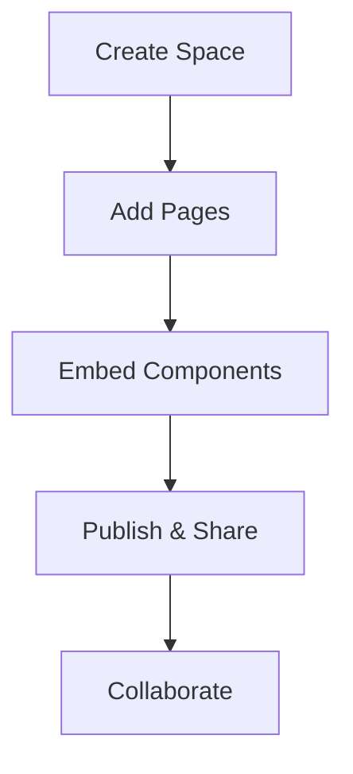

## Overview

Deepika Nallana provides a centralized space where you organize and manage all your project documentation. You create custom pages, embed code examples, and collaborate seamlessly with your team. This documentation hub scales with your projects, from simple READMEs to comprehensive guides.

<Callout kind="tip">
  Start by exploring the key features below to see how Deepika Nallana simplifies your workflow.
</Callout>

## Key Features

Deepika Nallana offers powerful tools to streamline documentation. You benefit from intuitive organization, rich media support, and version control integration.

<Columns cols={3}>
  <Card title="Organized Spaces" icon="folder-tree" href="#organization">
    Group your docs into spaces by project or team. Nested folders keep everything accessible.
  </Card>
  <Card title="Rich Components" icon="components" href="#components">
    Embed interactive elements like tabs, steps, and diagrams directly in your pages.
  </Card>
  <Card title="Collaboration" icon="users" href="#collaboration">
    Share pages with permissions and track changes in real-time.
  </Card>
</Columns>

## Brand Guidelines

Maintain consistency across your documentation with Deepika Nallana's brand color `#3B82F6`. Use this blue hue for headings, buttons, and accents to reinforce your identity.

```css
:root {
  --brand-primary: #3B82F6;
  --brand-text: #1E293B;
}

.header {
  background-color: var(--brand-primary);
  color: var(--brand-text);
}
```

<Callout kind="info">
  Integrate the brand color in custom CSS or themes. Avoid overuse to maintain readability.
</Callout>

## Quick Start

Get up and running in minutes. Follow these steps to create your first documentation space.

<Steps>
  <Step title="Create a Space" icon="plus">
    Log in to `https://dashboard.example.com` and click "New Space". Enter a name like "Project Alpha".
  </Step>
  <Step title="Add Your First Page" icon="file-text">
    Select "New Page" and choose the `introduction.mdx` template. Start editing with MDX syntax.
  </Step>
  <Step title="Embed Components" icon="puzzle">
    Insert components like `<Columns>` for layouts. Save and preview live.
  </Step>
  <Step title="Publish and Share" icon="share-2">
    Set permissions and generate a shareable link: `https://docs.example.com/project-alpha`.
  </Step>
</Steps>

<CodeGroup tabs="JavaScript,Python">
  ```javascript
  // Example: Fetch space data
  const response = await fetch('https://api.example.com/spaces', {
    headers: { Authorization: `Bearer ${YOUR_API_KEY}` }
  });
  const spaces = await response.json();
  console.log(spaces);
  ```
  ```python
  # Example: List spaces
  import requests
  response = requests.get(
      'https://api.example.com/spaces',
      headers={'Authorization': f'Bearer {YOUR_API_KEY}'}
  )
  spaces = response.json()
  print(spaces)
  ```
</CodeGroup>

## Next Steps

Dive deeper into Deepika Nallana with these resources.

<Columns cols={2}>
  <Card title="Quickstart Guide" icon="zap" href="/quickstart">
    Set up advanced features and integrations quickly.
  </Card>
  <Card title="Authentication" icon="shield" href="/authentication">
    Secure your spaces with API keys and OAuth.
  </Card>
  <Card title="Configuration" icon="settings" href="/configuration">
    Customize themes and workflows.
  </Card>
  <Card title="Changelog" icon="git-branch" href="/changelog">
    Stay updated with the latest releases.
  </Card>
</Columns>



You now have everything to build organized documentation. Explore the features and start creating.